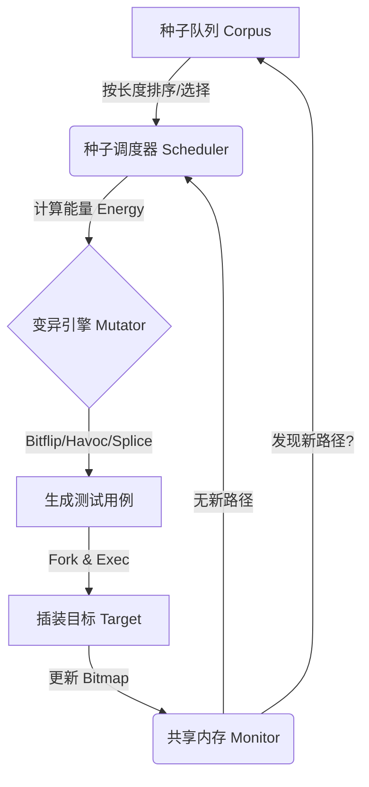

# 简易灰盒模糊测试工具 (Simple GreyBox Fuzzer)

这是一个基于 Python 实现的覆盖率引导（Coverage-Guided）灰盒模糊测试工具。本项目利用 **AFL++** 的插装组件进行编译，通过 **System V 共享内存** 获取程序的边覆盖率（Edge Coverage）反馈，实现了完整的“种子选择-变异-执行-评估”循环。

## 系统设计方案 (System Design)

### 1. 总体架构 (Architecture)
系统主要由 **Fuzzer Core** (核心测试引擎) 和 **Analyzer** (结果分析器) 两部分组成，运行在 Docker 容器环境中。



### 2. 类层次与核心组件 (Class Hierarchy)

核心逻辑封装在 `fuzzer/main.py` 的 `GreyBoxFuzzer` 类中：

* **`Monitor` (监控模块)**:
* 使用 `sysv_ipc` 创建大小为 64KB 的共享内存。
* 负责读取 AFL++ 插装程序写入的覆盖率位图 (Bitmap)。
* 实现了心跳机制 (Heartbeat)，即使无新路径发现也能持续记录存活状态。


* **`Mutator` (变异引擎)**:
* 实现了全套 AFL 基础算子：`Bitflip` (位翻转), `Byteflip`, `Arith` (算术运算), `Interest` (感兴趣值替换), `Havoc` (随机破坏)。
* **(加分项)** `Splice`: 实现了种子拼接功能，能够融合两个父代种子的特征。


* **`Scheduler` (调度器)**:
* **种子选择**: 优先选择长度较短的种子 (Top 20%)，提高执行吞吐率。
* **能量调度 (Power Schedule)**: 根据当前种子的覆盖贡献动态计算变异次数。


* **`Executor` (执行器)**:
* 使用 `subprocess` 启动子进程，通过标准输入 (stdin) 投递测试数据。


### 3. 可视化分析

`fuzzer/analyze.py` 负责读取运行时生成的 CSV 日志，基于 `matplotlib` 绘制覆盖率随时间变化的增长曲线，并生成 Markdown 格式的测试报告。

---

## 🚀 快速开始 (Quick Start)

### 1. 环境构建

本项目依赖 Docker 环境，请确保已安装 Docker Desktop。

```bash
# 1. 进入项目根目录
cd FuzzingTest_Project

# 2. 构建镜像 (自动配置 AFL++ 和 Python 环境)
# 注意：构建过程使用了南京大学镜像源加速
docker build -t my-fuzzer:v1 -f docker/Dockerfile .

```

### 2. 启动测试

所有测试任务均在容器内自动完成。

```bash
# 1. 启动并进入容器 (将当前目录挂载到容器内的 /app，以便保存测试结果)
docker run -it -v ${PWD}:/app --name fuzzer_env my-fuzzer:v1

# --- 以下命令在容器终端内执行 ---

# 2. 解决潜在的 Windows 换行符问题 (如果脚本无法运行)
dos2unix run_fuzz_task.sh

# 3. 运行自动化测试任务
# 该脚本会自动编译 targets/ 下的 10 个目标程序，并依次并行进行模糊测试
cd /app
./run_fuzz_task.sh

```

**提示**: 默认测试时间可能较短，如需进行 24 小时完整测试，请修改 `run_fuzz_task.sh` 中的超时参数。

### 3. 查看结果

测试完成后，结果文件会保存在 `out/` 目录下：

* 📄 **`experiment_report.md`**: 包含所有目标的最终覆盖率和耗时统计。
* 📈 **`multi_target_comparison.png`**: 10 个测试目标的覆盖率增长趋势对比图。
* 📊 **`stats_targetX.csv`**: 详细的运行时数据日志。

---

## 📂 项目结构 (Structure)

```text
FuzzingTest
├── docker/                 # Docker 配置文件
│   └── Dockerfile          # 镜像构建脚本 (Ubuntu 22.04 + AFL++)
├── docs/                   # 文档
│   └── devlog.md           # 开发日志 (记录踩坑与解决过程)
├── fuzzer/                 # 核心代码目录
│   ├── main.py             # Fuzzer 主程序 (核心逻辑实现)
│   ├── analyze.py          # 数据分析与可视化脚本
│   └── check_coverage.py   # 辅助验证工具
├── out/                    # [自动生成] 测试结果输出目录
├── targets/                # 待测目标程序 (C 源码)
├── seeds/                  # 初始种子文件
├── run_fuzz_task.sh        # 自动化运行脚本 (编译+测试+报告)
├── requirements.txt        # Python 依赖库
└── README.md               # 项目说明文档

```

## ✨ 功能特性 (Features)

* [x] **Docker 环境**: 一键部署，集成 AFL++ 工具链。
* [x] **AFL++ 插装对接**: 兼容 `afl-cc` 编译的二进制文件。
* [x] **完整变异策略**: Bitflip, Byteflip, Arith, Interest, Havoc。
* [x] **高级特性**:
* Splice 拼接算子。
* 基于覆盖率的能量调度 (Power Schedule)。
* 心跳日志记录 (Heartbeat Logging)。


* [x] **自动化报表**: 自动生成 Markdown 表格和覆盖率趋势图。

```

```

