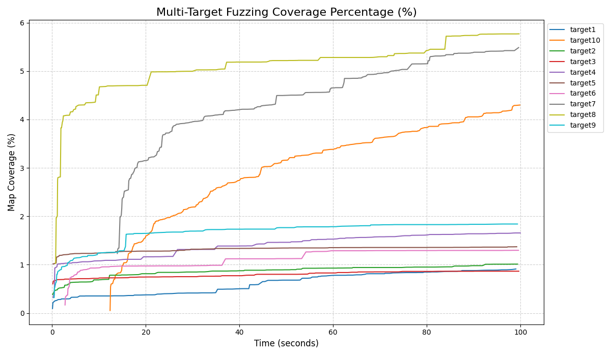

# Fuzzing 实验多目标测试报告

## 1. 测试汇总表格

| 目标名称 | 最终覆盖边数 | 覆盖率 (%) | 测试耗时 (s) |
| :--- | :--- | :--- | :--- |
| target1 | 597 | 0.9109% | 99.02 |
| target10 | 2817 | 4.2984% | 99.87 |
| target2 | 663 | 1.0117% | 99.39 |
| target3 | 567 | 0.8652% | 99.65 |
| target4 | 1085 | 1.6556% | 99.98 |
| target5 | 898 | 1.3702% | 99.21 |
| target6 | 850 | 1.2970% | 99.58 |
| target7 | 3595 | 5.4855% | 99.61 |
| target8 | 3781 | 5.7693% | 99.70 |
| target9 | 1206 | 1.8402% | 99.36 |

## 2. 覆盖率增长趋势 (绝对值)

## 3. 覆盖率增长趋势 (百分比)

