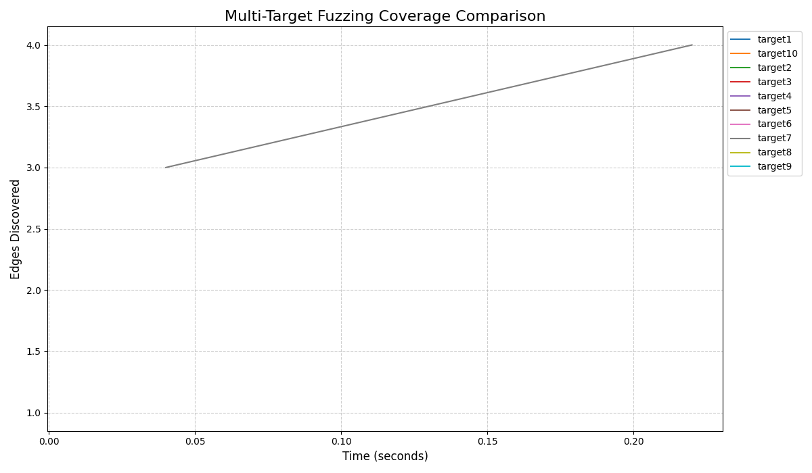

# Fuzzing 实验多目标测试报告

## 1. 测试汇总表格

| 目标名称 | 最终覆盖边数 | 测试耗时 (s) |
| :--- | :--- | :--- |
| target1 | 68 | 29.93 |
| target10 | 423 | 33.59 |
| target2 | 35 | 32.54 |
| target3 | 228 | 34.51 |
| target4 | 181 | 32.27 |
| target5 | 78 | 32.20 |
| target6 | 82 | 30.07 |
| target7 | 931 | 33.82 |
| target8 | 824 | 30.49 |
| target9 | 386 | 31.68 |

## 2. 覆盖率增长对比图

